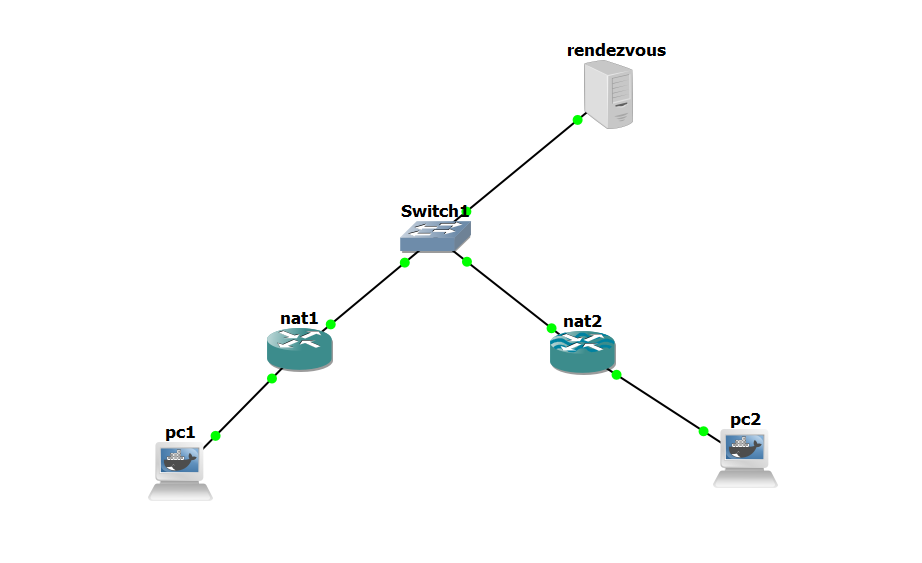

# NAT Hole Punching

Этот проект демонстрирует метод NAT hole punching с использованием рандеву сервера и двух клиентов. Клиенты обмениваются ip адресами через рандеву сервер для установления прямого соединения.

## Использование

### Запуск рандеву сервера

1. Откройте терминал и перейдите в директорию проекта.
2. Запустите рандеву сервер:
    ```sh
    python src/server.py
    ```
3. Введите IP-адрес сервера, когда будет предложено.

### Запуск клиента

1. Откройте новый терминал и перейдите в директорию проекта.
2. Запустите клиента:
    ```sh
    python src/client.py
    ```
3. Введите IP-адрес рандеву сервера, когда будет предложено.

## Пример конфигурации

Ниже представлен пример конфигурации для тестирования NAT hole punching.


